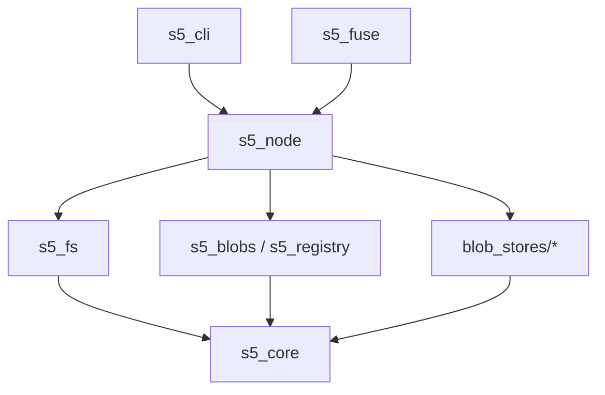

# S5

[](LICENSE-MIT)
[](https://github.com/s5-dev/s5-rs/actions)
[](https://github.com/s5-dev/s5-rs)

**S5** is a modular, high-performance content-addressed storage (CAS) network built on top of [Iroh](https://iroh.computer).

It gives you:

- A small, well-factored Rust API for **content addressing, blob transport, and mutable registries**.
- **FS5**, an encrypted, content-addressed filesystem with snapshot semantics.
- A **node + CLI** that wires everything together with pluggable **S5 store backends** (local FS, S3, Sia, in-memory).

If you are familiar with IPFS or Iroh: think of S5 as a focused, Rust-native toolkit for building distributed storage and sync flows, with strong separation between **wire-stable protocol types** and **high-level ergonomics**.

> **Status**: Version `1.0.0-beta.1`. Wire-level protocol types (`Hash`, `BlobId`, `BlobLocation`, registry/stream messages) are treated as stable for the 1.0 series; library APIs may still evolve between betas.

## Quick Install

```bash
cargo install --git https://github.com/s5-dev/s5-rs s5_cli
```

Minimal workflow:

```bash
s5 config init                # create local node config
s5 start                      # start node (in one terminal)
s5 import local ./my-data     # import files into default store
s5 tree                       # inspect FS5 view of imported data
```

## Architecture

The S5 stack is composed of layered crates, moving from low-level primitives to high-level applications:



1.  **Core (`s5_core`)**: Defines the wire-stable protocol types (`Hash`, `BlobId`, `BlobLocation`) and abstract traits (`Store`, `RegistryApi`).
2.  **Storage (`blob_stores/*`)**: Concrete backends for storing immutable blobs (Local disk, S3, Sia, Memory).
3.  **Network (`s5_blobs`, `s5_registry`)**: Iroh-based transport protocols for exchanging blobs and registry updates.
4.  **Filesystem (`s5_fs`)**: A content-addressed filesystem abstraction. Directories are immutable snapshots (`DirV1`) managed by stateful actors.
5.  **Orchestration (`s5_node`)**: Wires together storage, networking, and filesystem logic into a runnable server.
6.  **Interface (`s5_cli`, `s5_fuse`)**: User-facing tools to interact with the node.

### Typical Data Flow

1. **Ingest**: an importer (local filesystem or HTTP) writes file contents into a `BlobStore` and stores `FileRef`s in an FS5 directory snapshot.
2. **Addressing**: the directory snapshot and blobs are addressed by BLAKE3 hashes (`Hash` / `BlobId`).
3. **Publication**: a registry stream entry points to the latest snapshot hash.
4. **Networking**: other nodes fetch blobs via `s5_blobs` and the registry state via `s5_registry` over Iroh.

## Workspace Crates

| Crate | Description |
|-------|-------------|
| **[s5_core](./s5_core)** | **Protocol Primitives.** `Hash`, `BlobId`, `Store` trait, `RegistryApi` trait. The foundation of the stack. |
| **[s5_fs](./s5_fs)** | **Filesystem Logic.** Implements `DirV1` snapshots, directory actors, and the high-level `FS5` API. |
| **[s5_node](./s5_node)** | **Server & Orchestration.** Configures and runs the S5 node, managing stores, networking, and sync. |
| **[s5_cli](./s5_cli)** | **Command Line Interface.** The primary tool for interacting with S5 (`s5 blobs`, `s5 mount`, etc.). |
| **[s5_blobs](./s5_blobs)** | **Blob Transport.** Iroh-based protocol for serving and fetching blobs over the network. |
| **[s5_registry](./s5_registry)** | **Registry Transport.** Iroh-based protocol for syncing mutable registry entries. |
| **[s5_fuse](./s5_fuse)** | **FUSE Mount.** Mounts an S5 filesystem locally using FUSE. |
| **[blob_stores](./blob_stores)** | **Storage Backends.** Implementations of the `Store` trait: `local`, `s3`, `sia`, `memory`. |
| **[importers](./importers)** | **Data Ingestion.** Tools to import data into S5 from external sources (`local` fs, `http`). |

## Key Concepts

*   **Blob**: Immutable bytes, identified by a **BLAKE3** content hash. Everything else in S5 is ultimately built on blobs.
*   **BlobId**: Canonical identifier combining the content `Hash` with the content size (`u64`) for efficient allocation and verification.
*   **Snapshot (`DirV1`)**: A content-addressed directory state at a specific point in time. FS5 mutability comes from appending new snapshots; each snapshot is a single CBOR structure.
*   **Registry**: A mutable, append-only log of signed messages mapping a public key (`StreamKey`) to payloads (e.g., a root snapshot hash). This is how S5 handles mutability on top of immutable blobs.
*   **Storage (`Store` / `BlobStore`)**: A trait for pluggable backends (local disk, S3, Sia renterd, memory, or your own), with a `BlobStore` façade on top.
*   **Location (`BlobLocation`)**: Decouples *what* data is (hash) from *where* it lives (peer, bucket, Sia host, etc.).
*   **Networking (Iroh)**: Two small protocols, `s5_blobs` and `s5_registry`, run on top of Iroh for blob and registry exchange.

## Comparison

### vs. IPFS
*   **Library-First**: S5 is designed as a modular Rust toolkit, not a monolithic daemon. You can use just the `s5_fs` crate without the networking, or just `s5_blobs` without the filesystem.
*   **Transport**: S5 uses **Iroh** (QUIC + BLAKE3) for peer-to-peer connections, avoiding the complexity and overhead of the full libp2p stack and global DHT.
*   **Storage**: S5 treats external storage (S3, Sia) as first-class backends via the `Store` trait, rather than requiring "pinning services" or sidecar processes.

### vs. Iroh
*   **Layering**: S5 is built *on top* of Iroh. Iroh provides the "pipes" (connections, magichash, hole punching); S5 provides the "OS" (hierarchical filesystem, mutable registry, multi-backend storage abstraction).
*   **Protocol**: S5 defines specific wire formats (`DirV1`, `StreamMessage`) that are distinct from Iroh's internal protocols.

### vs. Object Storage (S3)
*   **Addressing**: S3 is location-addressed (`bucket/key`). S5 is content-addressed (`Hash`). This enables automatic deduplication and verification.
*   **Encryption**: S5 supports client-side encryption (XChaCha20-Poly1305) at the filesystem layer (`s5_fs`), meaning the storage backend (S3, Sia) never sees plaintext or directory structures.

## Innovative Workflows

### Encrypted Sync via Untrusted Peers
S5 enables end-to-end encrypted file synchronization between two nodes using a third, untrusted node as a relay.
1.  **Node A** writes files to an encrypted `FS5` snapshot.
2.  **Node A** pushes the encrypted blobs and registry update to **Node B** (untrusted relay).
3.  **Node C** pulls the registry update from **Node B**, verifies the signature, and fetches the encrypted blobs.
4.  **Node C** decrypts the snapshot locally using the shared secret.
*Node B sees only opaque blobs and signed messages.*

### Decentralized CDN (Sia + S5)
By implementing the `Store` trait for Sia (`s5_store_sia`), an S5 node can act as a gateway.
*   **Upload**: Users upload files to the S5 node, which streams them directly to the Sia network.
*   **Access**: The S5 node provides `BlobLocation::SiaFile` to clients, allowing them to fetch data directly from Sia hosts (if supported) or proxy through the node, all addressed by a stable S5 `BlobId`.

## Documentation

*   **[CLI Reference](docs/reference/cli.md)**: Comprehensive guide to the `s5` command.
*   **[Configuration](docs/reference/configuration.md)**: Node configuration schema.
*   **[S5 Workflows](docs/guides/s5-workflows.md)**: Detailed examples of sync and import flows.
*   **[Sia Web CDN](docs/guides/sia-web-cdn.md)**: Guide for using S5 with Sia.

## Contributing

Contributions are welcome! Please feel free to open an issue or submit a pull request.

*   **[GitHub Issues](https://github.com/s5-dev/s5-rs/issues)**: Bug reports, feature requests, and questions.
*   **[AGENTS.md](./AGENTS.md)**: Guidelines for working with the codebase (code style, design principles, crate organization).

## Development

### Prerequisites
*   Rust (stable)

### Build & Test

```bash
# Build all crates
cargo build --workspace

# Run all tests
cargo test --workspace

# Run lints
cargo clippy --workspace --all-targets -- -D warnings
```

### Running the CLI

```bash
# Run the CLI directly
cargo run -p s5_cli -- --help

# Example: Upload a blob (requires a configured peer named "friend")
cargo run -p s5_cli -- blobs upload --peer friend ./path/to/file
```

## License

This project is dual-licensed under the MIT and Apache 2.0 licenses.

This project is supported by a [Sia Foundation](https://sia.tech/grants) grant.
